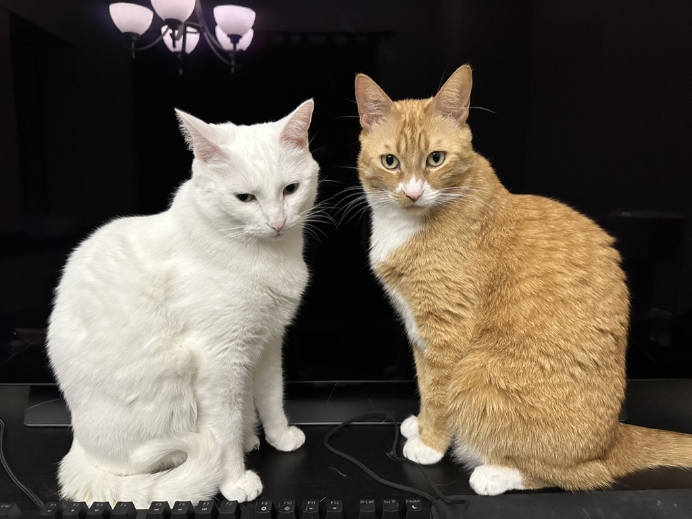

## About me

Hello world. Time to introduce myself. My name is Yuhan Zhao. I am from China. My home town is Zibo, an old city that relies on the industry. When compared to Winnipeg, Zibo has a population of 2.7 million, about three times of Winnipeg. And GDP is around 95 billion after coveting to Canadian dollars, while about twice of Winnipeg. My family has three people: my parents and I. Here in Winnipeg, I am living with my cats: the ginger cat XiaoGou and the white cat Nuomi.

##

### My skills

##

### My stats

